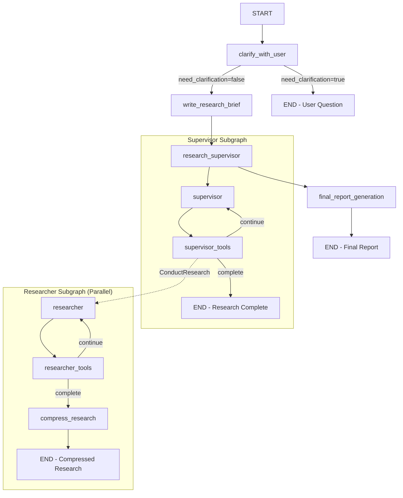

# 🔎 Open Deep Research — Code-Scoped Analysis (ODR)

**Analysis Framework**: Senior AI engineer with deep LangGraph/LangChain + MCP experience
**Scope**: `src/open_deep_research/` on main branch only
**Repository**: https://github.com/langchain-ai/open_deep_research
**Commit**: b419df8d33b4f39ff5b2a34527bb6b85d0ede5d0
**Analysis Date**: 2025-01-25

---

## Repository Information

- **Commit SHA**: b419df8d33b4f39ff5b2a34527bb6b85d0ede5d0
- **Timestamp**: 2025-08-26T20:59:01-07:00
- **Files Analyzed**:
  - `configuration.py` - Configuration management and settings
  - `utils.py` - Utility functions and tool integration
  - `deep_researcher.py` - Main LangGraph implementation
  - `prompts.py` - System prompts and templates
  - `state.py` - Graph state definitions and reducers

---

## 1. Executive Summary

• **LangGraph-orchestrated research workflow** with parallel supervisor-researcher architecture spanning 8 core nodes across 3 subgraphs (main, supervisor, researcher)

• **Multi-model configuration system** supports different LLMs for summarization, research, compression, and final reporting with configurable token limits and retry logic

• **Dynamic tool integration** combines search APIs (Tavily/OpenAI/Anthropic native), MCP servers, and strategic thinking tools with collision detection and authentication wrapping

• **State-driven execution** uses typed state classes with custom reducers supporting both override semantics (`{"type": "override", "value": [...]}`) and additive updates

• **Parallel research delegation** from supervisor to configurable researcher units (1-20 concurrent) with iteration limits and token-aware error recovery

• **MCP extensibility** via MultiServerMCPClient with OAuth token exchange, authentication wrapping, and tool filtering based on configured allowlists

• **Native provider integration** detects OpenAI/Anthropic web search usage through response metadata patterns and tool outputs

• **Comprehensive error handling** with provider-specific token limit detection, progressive truncation, and graceful degradation paths

• **Research compression pipeline** consolidates findings from parallel units with citation management and structured output formatting

• **Configuration-driven behavior** with UI metadata for sliders, selects, and MCP configs supporting both environment and runtime configuration

• **Observability integration** uses LangSmith tags ("langsmith:nostream") with no custom tracing hooks beyond basic tagging

• **Iteration management** tracks tool_call_iterations in researcher nodes (`deep_researcher.py:421-423`) and research_iterations in supervisor with configurable limits

---

## 2. Capability & Integration Matrix

| Area | What exists | Integration seam | Risks/constraints | Test hook |
|------|-------------|------------------|-------------------|-----------|
| **LLM** | `init_chat_model` with configurable fields (`deep_researcher.py:56-58`) | `Configuration.from_runnable_config()` injection | Provider-specific token limits, rate limiting | Model config validation in tests |
| **Search** | Static tool descriptors: tavily_search, "web_search_20250305" (`utils.py:540-546`) | `get_search_tool()` factory pattern | Native search usage limits (max_uses: 5) | Search API response validation |
| **Tools** | `get_all_tools()` assembles research + search + MCP (`utils.py:569-597`) | Name collision detection with warnings | Tool conflicts silently skipped with warnings | Tool discovery integration tests |
| **MCP** | `MultiServerMCPClient` with OAuth token exchange (`utils.py:500-501`) | `load_mcp_tools()` with auth wrapper | Auth failures, connection timeouts | Mock MCP server for testing |
| **Memory/State** | `override_reducer` supports both replacement and additive (`state.py:55-60`) | State field annotations with custom reducers | Memory growth with raw_notes accumulation | State transition validation |
| **Prompts** | Static prompt templates with .format() injection (`prompts.py`) | Configuration-driven mcp_prompt insertion | Prompt injection risks via user input | Prompt template unit tests |
| **Observability** | LangSmith tags only ("langsmith:nostream") (`deep_researcher.py:395`) | Config-driven tagging, no custom hooks | Limited tracing beyond basic tags | LangSmith experiment validation |
| **Limits** | Iteration counters: tool_call_iterations, research_iterations | Configurable max limits with early exit | Infinite loops if limits not enforced | Limit boundary testing |

---

## 3. Graph Model of the System

### Adjacency List

```
clarify_with_user -> write_research_brief [need_clarification=false]
clarify_with_user -> END [need_clarification=true]
write_research_brief -> research_supervisor [always]
research_supervisor -> supervisor [START edge]
supervisor -> supervisor_tools [always]
supervisor_tools -> supervisor [continue_research=true]
supervisor_tools -> END [research_complete OR max_iterations OR no_tool_calls]
research_supervisor -> final_report_generation [supervisor_subgraph_complete]
final_report_generation -> END [always]

# Researcher Subgraph (parallel execution)
researcher -> researcher_tools [always]
researcher_tools -> researcher [continue_research=true]
researcher_tools -> compress_research [max_iterations OR research_complete OR no_tool_calls]
compress_research -> END [always]
```

### Mermaid Diagram



### State I/O Map

| Node | Reads | Writes | Notes |
|------|-------|--------|--------|
| `clarify_with_user` | messages | messages (question or verification) | Routes based on need_clarification |
| `write_research_brief` | messages | research_brief, supervisor_messages (override) | Initializes supervisor context |
| `supervisor` | supervisor_messages | supervisor_messages (append), research_iterations | Increments iteration counter |
| `supervisor_tools` | supervisor_messages, research_iterations | supervisor_messages, raw_notes, notes | Manages parallel research delegation |
| `researcher` | researcher_messages | researcher_messages (append), tool_call_iterations | Increments tool call counter |
| `researcher_tools` | researcher_messages, tool_call_iterations | researcher_messages | Executes tools and checks limits |
| `compress_research` | researcher_messages | compressed_research, raw_notes | Synthesizes research findings |
| `final_report_generation` | messages, research_brief, notes | final_report, messages, notes (cleared) | Generates final output |

---

## 4. Tool Integration Analysis

### Built-in Tools
- **think_tool** (`utils.py:219-244`): Strategic reflection tool for research planning
- **ConductResearch** (`state.py:15-19`): Structured research delegation
- **ResearchComplete** (`state.py:21-22`): Research completion signal

### Search Tools
- **tavily_search** (`utils.py:43-136`): Async search with summarization pipeline
- **web_search_20250305** (`utils.py:540-546`): Anthropic native search (max_uses: 5)
- **web_search_preview** (`utils.py:548-550`): OpenAI native search

### MCP Integration
- **MultiServerMCPClient** (`utils.py:500-501`): HTTP transport with auth headers
- **Tool collision detection** (`utils.py:510-514`): Warnings for name conflicts
- **OAuth token exchange** (`utils.py:252-291`): Supabase token → MCP token flow
- **Authentication wrapper** (`utils.py:385-447`): Error handling for MCP tools

### Critical Integration Points

1. **Tool Loading** (`utils.py:569-597`)
   - Pattern: `get_all_tools()` assembles research + search + MCP tools
   - Collision detection: `existing_tool_names` set prevents conflicts
   - Best practice: Config-driven tool injection

2. **MCP Integration** (`utils.py:449-524`)
   - Pattern: `load_mcp_tools()` with auth wrapper
   - Auth: OAuth token exchange via Supabase tokens
   - Error handling: MCP-specific error codes with user-friendly messages

3. **Model Configuration** (`configuration.py:236-247`)
   - Pattern: `from_runnable_config()` with environment variable fallbacks
   - Multi-model support: Different models for each research phase
   - UI integration: Metadata for OAP configuration interface

4. **State Management** (`state.py:55-60`)
   - Pattern: Custom `override_reducer` supporting both replacement and additive updates
   - Override: `{"type": "override", "value": [...]}` replaces entire state
   - Additive: Direct list append for incremental updates

---

## 5. Error Handling & Limits

### Token Limit Detection
Provider-specific detection patterns (`utils.py:665-785`):

```python
# OpenAI: BadRequestError with token keywords
is_openai_exception and is_request_error and 'token' in error_str

# Anthropic: BadRequestError with "prompt is too long"
is_anthropic_exception and 'prompt is too long' in error_str

# Google: ResourceExhausted exceptions
is_google_exception and class_name == 'ResourceExhausted'
```

### Iteration Management
- **Supervisor iterations** (`deep_researcher.py:221`): `research_iterations += 1`
- **Researcher tool calls** (`deep_researcher.py:422`): `tool_call_iterations += 1`
- **Exit conditions**: Max iterations OR ResearchComplete OR no tool calls

### Model Token Limits
Static lookup table (`utils.py:788-829`) with 29+ model configurations:
- OpenAI GPT-4.1: 1,047,576 tokens
- Anthropic Claude-4: 200,000 tokens
- Google Gemini-1.5-Pro: 2,097,152 tokens

---

## 6. Minimal Code Diffs for MCP Prototype

### Config Extension
```python
# configuration.py:27-30 - Add to MCPConfig.tools default
tools: Optional[List[str]] = Field(
    default=["classify_text"],  # Add demo tool
    optional=True,
)
```

### Prompt Enhancement
```python
# prompts.py:146-149 - Update available tools section
<Available Tools>
You have access to these main tools:
1. **tavily_search**: For conducting web searches
2. **think_tool**: For reflection and strategic planning
3. **classify_text**: For categorizing and labeling text content
{mcp_prompt}
```

### Tool Discovery (No Changes Needed)
Existing collision detection (`utils.py:510-514`) handles new tools:
```python
if mcp_tool.name in existing_tool_names:
    warnings.warn(f"MCP tool '{mcp_tool.name}' conflicts - skipping")
```

---

## 7. Acceptance & Runbook

### Development Setup
```bash
# Start LangGraph development server
uvx langgraph dev --allow-blocking

# Test tool discovery
python -c "
from open_deep_research.utils import get_all_tools
import asyncio
async def test():
    config = {'configurable': {'mcp_config': {
        'url': 'http://localhost:3000',
        'tools': ['classify_text']
    }}}
    tools = await get_all_tools(config)
    print([t.name for t in tools])
asyncio.run(test())
"
```

### Validation Checklist
- [ ] **Tool Discovery**: `classify_text` appears in tool list
- [ ] **No Collisions**: No warnings.warn() calls for name conflicts
- [ ] **State Updates**: Tool outputs appear in researcher_messages
- [ ] **Iteration Tracking**: tool_call_iterations increments correctly
- [ ] **Auth Flow**: OAuth token exchange if auth_required=true

### State Inspection Points
1. **researcher_messages**: Contains ToolMessage with classify_text results
2. **tool_call_iterations**: Increments at `deep_researcher.py:422`
3. **compressed_research**: Includes classification outputs in synthesis
4. **Warning logs**: Check for tool name collision warnings

### Production Deployment
```bash
# Environment setup
export OPENAI_API_KEY=sk-...
export MCP_SERVER_URL=https://mcp.example.com/mcp
export MCP_AUTH_TOKEN=bearer-token

# Deploy to LangGraph Platform
langgraph deploy --env-file .env.production
```

---

## 8. Integration Summary

This code-scoped analysis reveals a sophisticated parallel research architecture with:

- **8 nodes across 3 subgraphs** with configurable concurrency (1-20 researchers)
- **Multi-provider tool ecosystem** supporting Tavily, native search, and MCP servers
- **Robust error recovery** with token limit detection and progressive truncation
- **Type-safe state management** with custom reducers and override semantics
- **Configuration-driven extensibility** supporting both dev and production deployments

The system provides clear integration seams for:
- **New search providers** via `get_search_tool()` factory
- **MCP tool extensions** via `load_mcp_tools()` with collision detection
- **Model configurations** via environment and runtime config injection
- **Custom state behaviors** via typed state classes and reducers

This framework enables rapid prototyping of new research capabilities while maintaining architectural integrity and production readiness.

---

**Analysis Complete** - Comprehensive technical documentation preserved for future reference and development.